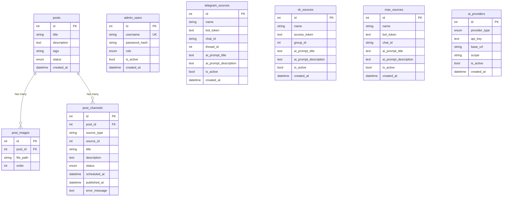

# Database Schema

> **Context:** Read this file before creating or modifying tables, columns, indexes, or migrations. The database is the source of truth. Every schema change must be reflected here immediately.
> **Version:** 1.1

---

## 1. Core Principles

- The database is the source of truth
- Every table must be documented in this file
- Every column must be explained with its purpose
- Every relationship must be explicit
- Schema changes without updating this file are forbidden
- No Alembic — all migrations are additive `ALTER TABLE ... ADD COLUMN` statements registered in the `_migrate()` function in `main.py`

---

## 2. Technology

| Setting | Value |
|---------|-------|
| Engine | SQLite |
| ORM | SQLAlchemy (mapped_column / Mapped style) |
| File | `data/admin.db` |
| Session | `SessionLocal` (synchronous, `check_same_thread=False`) |
| Base class | `app.database.Base` (DeclarativeBase) |
| Migrations | Manual additive in `main.py:_migrate()` |

---

## 3. ERD (Mermaid)



> **Note:** `post_channels.source_id` is NOT a database-level FK. Source resolution is done in Python using `source_type` as a discriminator. This is intentional to support heterogeneous source tables without a polymorphic join.

---

## 4. Table Documentation

### 4.1 `posts`

**Purpose:** Master post record holding content that will be published to one or more platform channels.

| Column | Type | Nullable | Default | Description |
|--------|------|----------|---------|-------------|
| id | INTEGER | No | autoincrement | Primary key |
| title | VARCHAR(256) | No | — | Post headline. Required. |
| description | TEXT | Yes | NULL | Body text of the post |
| tags | VARCHAR(512) | Yes | NULL | Comma-separated tag list, e.g. `"news, tech"` |
| status | ENUM | No | `draft` | See PostStatus enum below |
| created_at | DATETIME | No | utcnow | Creation timestamp (naive UTC) |

**Relationships:**
- `post_images` — one-to-many, cascade delete-orphan, ordered by `PostImage.order`
- `post_channels` — one-to-many, cascade delete-orphan

---

### 4.2 `post_images`

**Purpose:** Stores references to uploaded image files attached to a post.

| Column | Type | Nullable | Default | Description |
|--------|------|----------|---------|-------------|
| id | INTEGER | No | autoincrement | Primary key |
| post_id | INTEGER FK | No | — | References `posts.id` (cascade delete) |
| file_path | VARCHAR(512) | No | — | Relative path from `BASE_DIR`, e.g. `data/uploads/42/photo.jpg` |
| order | INTEGER | No | 0 | Send/display order (0 = first) |

---

### 4.3 `post_channels`

**Purpose:** Represents one publication target for a post. A single post can have multiple channels, one per selected platform source.

| Column | Type | Nullable | Default | Description |
|--------|------|----------|---------|-------------|
| id | INTEGER | No | autoincrement | Primary key |
| post_id | INTEGER FK | No | — | References `posts.id` (cascade delete) |
| source_type | VARCHAR(64) | No | — | `"telegram"`, `"vk"`, or `"max"` |
| source_id | INTEGER | No | — | PK of the corresponding source table row |
| title | VARCHAR(256) | Yes | NULL | Channel-level title override; falls back to `post.title` |
| description | TEXT | Yes | NULL | Channel-level description override; falls back to `post.description` |
| status | ENUM | No | `pending` | See ChannelStatus enum below |
| scheduled_at | DATETIME | Yes | NULL | Publish at this time. NULL = publish immediately |
| published_at | DATETIME | Yes | NULL | Actual publish timestamp (set by worker on success) |
| error_message | TEXT | Yes | NULL | Last error string from publisher (truncated to 500 chars) |

**Computed properties (ORM, not DB columns):**
- `effective_title` → `title or post.title`
- `effective_description` → `description or post.description`

---

### 4.4 `admin_users`

**Purpose:** Admin panel user accounts with role-based access.

| Column | Type | Nullable | Default | Description |
|--------|------|----------|---------|-------------|
| id | INTEGER | No | autoincrement | Primary key |
| username | VARCHAR(64) | No | — | Unique login name |
| password_hash | VARCHAR(256) | No | — | bcrypt hash; never store plain text |
| role | ENUM | No | `editor` | `superadmin` or `editor` |
| is_active | BOOLEAN | No | `True` | Inactive users cannot log in |
| created_at | DATETIME | No | utcnow | Creation timestamp |

**Unique constraint:** `username`

---

### 4.5 `telegram_sources`

**Purpose:** Configuration for a Telegram bot + channel/group publishing target.

| Column | Type | Nullable | Description |
|--------|------|----------|-------------|
| id | INTEGER | No | Primary key |
| name | VARCHAR(128) | No | Human-readable label |
| bot_token | TEXT (encrypted) | No | Telegram Bot API token. Stored as Fernet ciphertext via `EncryptedString`. |
| chat_id | VARCHAR(128) | No | `@channel_username` or numeric ID (`-1001234567890`) |
| thread_id | INTEGER | Yes | Topic ID for supergroup forums (optional) |
| ai_prompt_title | TEXT | Yes | System prompt for AI title rewrite. Added via `_migrate()`. |
| ai_prompt_description | TEXT | Yes | System prompt for AI description rewrite. Added via `_migrate()`. |
| is_active | BOOLEAN | No | Inactive sources excluded from post wizard step 2 |
| created_at | DATETIME | No | Creation timestamp |

---

### 4.6 `vk_sources`

**Purpose:** Configuration for a VKontakte community wall publishing target.

| Column | Type | Nullable | Description |
|--------|------|----------|-------------|
| id | INTEGER | No | Primary key |
| name | VARCHAR(128) | No | Human-readable label |
| access_token | TEXT (encrypted) | No | VK community or user token. Stored encrypted. Requires `wall`, `photos`, `offline` for photos. |
| group_id | INTEGER | No | Numeric community ID (positive, without minus) |
| ai_prompt_title | TEXT | Yes | System prompt for AI title rewrite. Added via `_migrate()`. |
| ai_prompt_description | TEXT | Yes | System prompt for AI description rewrite. Added via `_migrate()`. |
| is_active | BOOLEAN | No | Active flag |
| created_at | DATETIME | No | Creation timestamp |

**Note:** Community tokens cannot upload photos (VK error 27). Use a user access token for photo publishing.

---

### 4.7 `max_sources`

**Purpose:** Configuration for a MAX Messenger bot + channel publishing target.

| Column | Type | Nullable | Description |
|--------|------|----------|-------------|
| id | INTEGER | No | Primary key |
| name | VARCHAR(128) | No | Human-readable label |
| bot_token | TEXT (encrypted) | No | MAX Bot API token from botapi.max.ru. Stored encrypted. |
| chat_id | VARCHAR(128) | No | Numeric channel/chat ID |
| ai_prompt_title | TEXT | Yes | System prompt for AI title rewrite. Added via `_migrate()`. |
| ai_prompt_description | TEXT | Yes | System prompt for AI description rewrite. Added via `_migrate()`. |
| is_active | BOOLEAN | No | Active flag |
| created_at | DATETIME | No | Creation timestamp |

---

### 4.8 `ai_providers`

**Purpose:** Unified registry of AI providers for text generation. Exactly one record may have `is_active=True` at a time.

| Column | Type | Nullable | Default | Description |
|--------|------|----------|---------|-------------|
| id | INTEGER | No | autoincrement | Primary key |
| provider_type | ENUM | No | — | `openai` or `gigachat` |
| api_key | TEXT (encrypted) | No | — | OpenAI secret key (`sk-...`) or GigaChat Authorization key (Base64). Stored encrypted. |
| base_url | VARCHAR(512) | Yes | NULL | Custom OpenAI-compatible endpoint (Azure, proxy). NULL = `https://api.openai.com` |
| scope | VARCHAR(64) | Yes | NULL | GigaChat scope: `GIGACHAT_API_PERS` or `GIGACHAT_API_CORP` |
| is_active | BOOLEAN | No | `False` | Only one active provider enforced by `after_create`/`after_edit` hooks |
| created_at | DATETIME | No | utcnow | Creation timestamp |

**Application-level constraints:**
- Only one record per `provider_type` — enforced in `AIProviderView.before_create` and `AIProviderWizardView._post_create`
- Only one `is_active=True` at a time — enforced in `after_create`/`after_edit` hooks via `_do_deactivate_others()`

---

## 5. Enum Inventory

### `posts.status` (PostStatus)

| Value | Meaning | Who sets it |
|-------|---------|-------------|
| `draft` | Wizard steps 1–2 not yet complete | Default on creation |
| `ready` | All channels configured; worker may publish | Wizard step 3 final POST |
| `published` | All `PostChannel` records are published | Worker, after last channel publishes |

### `post_channels.status` (ChannelStatus)

| Value | Meaning | Who sets it |
|-------|---------|-------------|
| `pending` | Awaiting publication | Default on creation |
| `published` | Successfully published | Worker on success |
| `failed` | Publication failed; see `error_message` | Worker on failure |

### `admin_users.role` (Role)

| Value | Permissions |
|-------|-------------|
| `superadmin` | Full access: create/edit/delete + AI providers + user management |
| `editor` | Create/edit posts and sources; no delete; no AI providers; no user management |

### `ai_providers.provider_type` (ProviderType)

| Value | Description |
|-------|-------------|
| `openai` | OpenAI API (gpt-4o-mini, `/v1/chat/completions`) |
| `gigachat` | Sber GigaChat (OAuth → `/api/v1/chat/completions`) |

---

## 6. Migration Rules

### 6.1 How to add a new column

```python
# ✅ Correct — register in _migrate() in main.py, then add to the ORM model
migrations = [
    ("post_channels", "retry_count", "INTEGER DEFAULT 0"),
]
```

```python
# ❌ Incorrect — never use Alembic, never drop or rename columns
# alembic revision --autogenerate ...
```

### 6.2 Rules

- Only additive changes: `ADD COLUMN`
- Never `DROP COLUMN`, `RENAME COLUMN`, or `RENAME TABLE` via migration
- New columns must be `nullable=True` or have a SQL `DEFAULT` so existing rows are not broken
- After adding a column to `_migrate()`, add its `Mapped` declaration to the SQLAlchemy model
- Update this schema file immediately after changing a table

---

## 7. Encrypted Fields

All sensitive fields (tokens, API keys) must use `EncryptedString`:

```python
# ✅ Correct
from app.models.encrypted import EncryptedString

class MySource(Base):
    api_key: Mapped[str] = mapped_column(EncryptedString, nullable=False)
```

```python
# ❌ Incorrect — stores credential in plain text in the database
class MySource(Base):
    api_key: Mapped[str] = mapped_column(String(256), nullable=False)
```

`EncryptedString` uses Fernet (AES-128-CBC + HMAC). The key is derived from `SECRET_KEY` via SHA-256. Legacy plain-text values in older rows are returned as-is (decryption failure fallback).

---

## Checklist

- [ ] All tables documented with all columns
- [ ] Column types, nullable, and descriptions filled in
- [ ] ERD Mermaid diagram includes all 8 active tables
- [ ] Encrypted fields noted in table docs
- [ ] All enum values listed with meanings
- [ ] Migration approach documented (additive only, `_migrate()`)
- [ ] New columns added to `_migrate()` AND the ORM model
- [ ] This file updated before any schema change is merged
