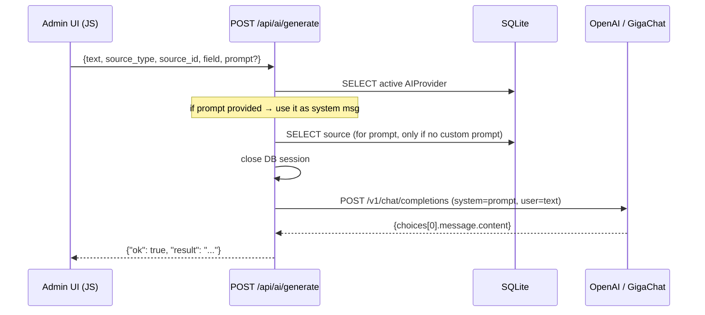

# AI Integration Domain Rules

> **Context:** Read this file before modifying AI provider management, the AI text generation endpoint, source-level AI prompts, or adding a new AI provider type.
> **Version:** 1.0

---

## 1. Core Principle

AI integration is optional and stateless from the post perspective. If no active provider exists, return an error — do not crash. GigaChat tokens are short-lived; fetch them per request, never store them. All provider credentials are encrypted.

---

## 2. What Is This Domain?

The AI layer allows users to rewrite post titles and descriptions using a configured AI provider before publishing. It consists of:

- **`ai_providers` table** — stores provider credentials and which one is active
- **`/api/ai/generate` endpoint** — accepts text + source context, calls the active provider, returns rewritten text
- **`/api/ai-provider/test` endpoint** — validates provider credentials without saving
- **`AIProviderWizardView`** — admin wizard for creating/editing providers
- **AI prompts on sources** — per-source system messages stored in `ai_prompt_title` and `ai_prompt_description`

### Key Concepts

| Concept | Description |
|---------|-------------|
| AIProvider | A configured AI backend (OpenAI or GigaChat) |
| is_active | Only one provider may be active at a time |
| ai_prompt_title | System prompt used when AI rewrites a post title for a specific source |
| ai_prompt_description | System prompt used when AI rewrites a description for a specific source |
| field | `"title"` or `"description"` — determines which prompt column to read |
| GigaChat OAuth token | Short-lived access token fetched per request, never stored |

---

## 3. Business Rules

**BR-001** — Only one `AIProvider` record may have `is_active=True` at any time. Activating a provider must deactivate all others.
_Enforced in:_ `app/admin.py @ AIProviderView.after_create()` and `after_edit()` via `_do_deactivate_others()`; also in `app/views/ai_provider.py @ _post_create()` and `_post_edit()`

**BR-002** — Only one record per `provider_type` (openai or gigachat) may exist. Duplicate type is rejected before save.
_Enforced in:_ `app/admin.py @ AIProviderView.before_create()` and `app/views/ai_provider.py @ _post_create()`

**BR-003** — All provider credentials (`api_key`) must be stored using `EncryptedString`. Never use plain `String` or `Text`.
_Enforced in:_ `app/models/providers/ai_provider.py`

**BR-004** — If no active provider exists, the generate endpoint must return `{"ok": false, "error": "Нет активного AI провайдера"}`. Do not raise an HTTP exception.
_Enforced in:_ `app/routers/ai_generate.py @ generate_text()`

**BR-005** — If the text field is empty, return `{"ok": false, "error": "Поле пустое — нечего обрабатывать"}` before calling the provider.
_Enforced in:_ `app/routers/ai_generate.py @ generate_text()`

**BR-006** — The `field` parameter determines which prompt column to read when no custom prompt is supplied: `"title"` → `source.ai_prompt_title`; `"description"` → `source.ai_prompt_description`. Custom `prompt` always takes precedence over the source-level prompt.
_Enforced in:_ `app/routers/ai_generate.py @ generate_text()`

**BR-007** — If the source does not exist or the prompt is NULL/empty (and no custom prompt provided), call the provider without a system message. Do not fail.
_Enforced in:_ `app/routers/ai_generate.py @ generate_text()`

**BR-013** — If the request body contains a non-empty `prompt` field, use it as the system message and skip source prompt lookup entirely.
_Enforced in:_ `app/routers/ai_generate.py @ generate_text()`

**BR-008** — GigaChat OAuth tokens are fetched per-request. Never store them in the database or any server-side cache.
_Enforced in:_ `app/routers/ai_generate.py @ _generate_gigachat()`

**BR-009** — GigaChat API calls must use `verify=False` due to Sber's internal CA. Suppress `InsecureRequestWarning` with `warnings.catch_warnings()`.
_Enforced in:_ `app/routers/ai_generate.py` and `app/routers/ai_provider.py`

**BR-010** — The DB session must be closed before calling any provider API. Never call external AI APIs inside a `with SessionLocal() as db:` block.
_Enforced in:_ `app/routers/ai_generate.py @ generate_text()` (loads provider and source, closes session, then calls API)

**BR-011** — The `AIProviderView` (list view) is `SuperadminOnly`. Editors must not see or manage AI providers.
_Enforced in:_ `app/admin.py @ AIProviderView(SuperadminOnly, ModelView)`

**BR-012** — Test endpoints must not save anything to the database. They validate credentials only.
_Enforced in:_ `app/routers/ai_provider.py`

---

## 4. Supported Providers

### 4.1 OpenAI

- **Auth:** `Authorization: Bearer {api_key}`
- **Default endpoint:** `https://api.openai.com`
- **Custom `base_url`:** supports Azure and proxy endpoints (strip trailing slash)
- **Model:** `gpt-4o-mini` (hardcoded — update here and in `ai_generate.py` if changing)
- **Completions URL:** `{base_url}/v1/chat/completions`
- **Validation URL:** `GET {base_url}/v1/models` (expect HTTP 200)
- **Timeout:** 60 s generation, 10 s connection test

### 4.2 GigaChat (Sber)

- **OAuth URL:** `POST https://ngw.devices.sberbank.ru:9443/api/v2/oauth`
  - Header: `Authorization: Basic {api_key}` (Base64 key from GigaChat cabinet)
  - Header: `RqUID: {uuid4()}`
  - Body: `scope={scope}` (form-encoded, defaults to `GIGACHAT_API_PERS`)
- **Completions URL:** `https://gigachat.devices.sberbank.ru/api/v1/chat/completions`
- **Model:** `GigaChat` (hardcoded)
- **SSL:** `verify=False` — required; do not remove
- **Scope values:** `GIGACHAT_API_PERS` (personal) or `GIGACHAT_API_CORP` (corporate)
- **Timeout:** 60 s generation, 10 s OAuth test

---

## 5. Generation Request Flow



---

## 6. API Response Contract

```python
# ✅ Correct success response
{"ok": True, "result": "rewritten text here"}

# ✅ Correct failure response
{"ok": False, "error": "human-readable error message"}

# ❌ Incorrect — raising HTTP exceptions from AI endpoints
raise HTTPException(status_code=500, detail="AI error")
```

All error conditions return `{"ok": False, "error": "..."}` with HTTP 200. Never raise `HTTPException` from generation or test endpoints.

---

## 7. Frontend AI Button Pattern

The AI rewrite button appears on post wizard step 3 (`step3.html`), the add-channel page (`add_channel.html`), and the edit-channel page (`edit_channel.html`). Clicking it opens a modal (`aiPromptModal`) where the user can optionally enter a custom prompt before triggering generation.

Flow:
1. User clicks AI button → modal opens, textarea cleared
2. User optionally types a custom system prompt
3. User clicks "Сгенерировать" → modal hides, `POST /api/ai/generate` is called
4. If custom prompt was entered: it is sent as `prompt` and takes priority over source's AI prompt
5. If custom prompt was left empty: backend falls back to source's `ai_prompt_title` / `ai_prompt_description`
6. On success: result is inserted into the target field; on error: overlay shows the error message

The macro `ai_modals()` renders the modal HTML; `ai_script()` renders the JS. Both must be included together on any page that uses AI buttons. If either element is absent, the IIFE exits silently via null guard.

The frontend implementation lives in `admin/templates/posts/_ai_generate.html`. Do not change the API response shape without updating these templates.

---

## 8. Adding a New AI Provider

1. Add a new value to `ProviderType` enum in `app/models/providers/ai_provider.py`
2. Implement `_generate_{provider}()` async function in `app/routers/ai_generate.py`
3. Implement `_test_{provider}()` async function in `app/routers/ai_provider.py`
4. Add dispatch branches in `generate_text()` and `test_connection()`
5. Update `AIProviderView.fields` in `app/admin.py` with any provider-specific fields
6. Update `AIProviderWizardView` template if provider-specific form fields are needed
7. Update this file and `rules/database/schema.md`

---

## Forbidden Behaviors

- ❌ Storing GigaChat `access_token` in the database — they are short-lived, fetch per request
- ❌ Sharing one `httpx.AsyncClient` across requests — create per-request with `async with`
- ❌ Enabling SSL verification for GigaChat — `verify=False` is required
- ❌ Raising `HTTPException` from generation or test endpoints — always return `{"ok": false, ...}`
- ❌ Calling AI provider APIs from inside an open `SessionLocal()` context
- ❌ Using `StringField` for `api_key` in admin views — always use `TokenField`

---

## Checklist

- [ ] Only one `AIProvider` with `is_active=True` at any time
- [ ] `after_create` and `after_edit` hooks deactivate other providers on activation
- [ ] Only one record per `provider_type`
- [ ] Generation endpoint returns `{"ok": bool, ...}` for all cases (no HTTP exceptions)
- [ ] Custom `prompt` field in request body takes priority over source-level AI prompt when non-empty
- [ ] GigaChat SSL verification disabled (`verify=False`), warnings suppressed
- [ ] GigaChat OAuth token fetched per-request, never stored
- [ ] DB session closed before any AI API call
- [ ] `httpx.AsyncClient` created per-request with appropriate timeout
- [ ] New provider type added to `ProviderType` enum AND dispatch logic
- [ ] `AIProviderView` remains `SuperadminOnly`
