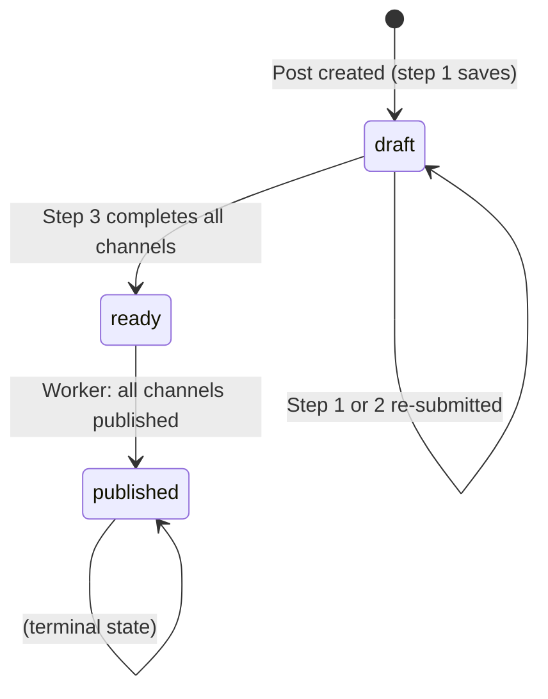

# Posts Domain Rules

> **Context:** Read this file before touching post creation, the 3-step wizard flow, PostStatus transitions, PostChannel logic, image uploads, or tag formatting.
> **Version:** 1.0

---

## 1. Core Principle

A **Post** is the master content record. It is never published directly — it is published through one or more **PostChannels**, each targeting a specific platform source. The wizard is the only supported creation path. The worker is the only authority for marking a post as published.

---

## 2. What Is This Domain?

A Post holds a title, optional description, comma-separated tags, and attached images. During the 3-step wizard, channels (PostChannel records) are created and configured per source. The background worker polls those channels and calls the appropriate publisher module for each one.

### Key Concepts

| Concept | Description |
|---------|-------------|
| Post | Master content record: title, description, tags, images |
| PostChannel | One publication target for a post (one per source selection) |
| PostStatus | Lifecycle state of the post: draft → ready → published |
| ChannelStatus | State of a single channel: pending → published / failed |
| effective_title | `channel.title` if set, else `post.title` |
| effective_description | `channel.description` if set, else `post.description` |

---

## 3. Business Rules

**BR-001** — A post title is required. The wizard step 1 must reject submissions with a blank title.
_Enforced in:_ `app/views/posts.py @ PostWizardView._post()` step 1

**BR-002** — At least one source must be selected in step 2. The wizard must show an error and stay on step 2 if no sources are chosen.
_Enforced in:_ `app/views/posts.py @ PostWizardView._post()` step 2

**BR-003** — Step 2 always deletes all existing PostChannel records for the post before recreating from the submitted source selection. This is a full replace, not a merge.
_Enforced in:_ `app/views/posts.py @ PostWizardView._post()` step 2

**BR-004** — `post.status` is set to `ready` only after step 3 has processed ALL channels. Never set it earlier.
_Enforced in:_ `app/views/posts.py @ PostWizardView._post()` step 3 (final channel)

**BR-005** — `post.status = published` must only be set by the worker, after it confirms all channels have `status = published`. No wizard handler or API endpoint may set this status.
_Enforced in:_ `app/worker.py @ _publish_channel()`

**BR-006** — A new PostChannel always starts with `status = pending`. Never create a channel with any other status.
_Enforced in:_ `app/models/post.py @ ChannelStatus` default

**BR-007** — The worker only processes channels whose parent post has status `ready` or `published`. Channels on `draft` posts are ignored.
_Enforced in:_ `app/worker.py @ _publish_channel()`

**BR-008** — `channel.effective_title` and `channel.effective_description` must always be used when assembling publish text. Never read `post.title` directly in publishers or the worker.
_Enforced in:_ `app/publisher/utils.py @ build_text()`

**BR-009** — `scheduled_at` is stored as naive local datetime (from a `datetime-local` HTML input). NULL means "publish as soon as the worker next runs." Never assume UTC.
_Enforced in:_ `app/views/posts.py` and `app/worker.py`

**BR-010** — Image file paths are stored relative to `BASE_DIR` (e.g., `data/uploads/42/photo.jpg`). Absolute paths must never be stored in the database.
_Enforced in:_ `app/views/posts.py @ PostWizardView._post()` step 1

**BR-011** — Images are appended on step 1 re-submit, not replaced. Individual images can be deleted via `DELETE /api/posts/image/{id}` (called from step 1 UI). The total number of images per post must not exceed `MAX_IMAGES_PER_POST` (10). This limit is enforced both server-side (step 1 POST handler) and client-side (JS file-picker guard).
_Enforced in:_ `app/views/posts.py @ PostWizardView._post()` step 1, `app/routers/posts.py @ delete_image`, `admin/templates/posts/step1.html` (JS)

**BR-014** — A post may have at most `MAX_IMAGES_PER_POST` (10) images. Attempts to upload more are rejected with an error message stating how many are already attached and how many are being added.
_Enforced in:_ `app/views/posts.py @ PostWizardView._post()` step 1

**BR-012** — Tags are stored as a raw comma-separated string. They are converted to `#hashtag` format at publish time via `format_tags()`, not at creation time.
_Enforced in:_ `app/publisher/utils.py @ format_tags()`

**BR-013** — When editing a channel from the post list (`from_list=1` param), the wizard redirects back to `/admin/posts` immediately after step 3, without advancing to the next channel.
_Enforced in:_ `app/views/posts.py @ PostWizardView._post()` step 3

---

## 4. Post Status Machine



---

## 5. Wizard Flow (3 Steps)

### Step 1 — Content

Route: `GET/POST /admin/posts/wizard?step=1[&post_id=N]`

Form fields: `title` (required), `description` (optional), `tags` (optional), `images[]` (file upload, optional)

Rules:
- Title is required — return step 1 with error if blank
- Images are stored under `data/uploads/{post_id}/`
- After save, redirect to `?post_id={id}&step=2`

### Step 2 — Select Sources

Route: `GET/POST /admin/posts/wizard?step=2&post_id=N`

Form fields: `telegram_sources[]`, `vk_sources[]`, `max_sources[]` (multi-select of active source IDs)

Rules:
- Only active sources (`is_active=True`) appear in the picker
- At least one source required — show error otherwise
- On submit: delete all existing channels for this post, recreate from selection
- After save, redirect to `?post_id={id}&step=3&channel_id={first_channel_id}`

### Step 3 — Customize Per Channel

Route: `GET/POST /admin/posts/wizard?step=3&post_id=N&channel_id=M`

Form fields: `title` (optional override), `description` (optional override), `scheduled_at` (optional ISO datetime)

Rules:
- After saving, advance to the next channel in the list
- When all channels are saved, set `post.status = ready` and redirect to `/admin/posts`
- `from_list=1` redirects immediately to `/admin/posts` without advancing

---

## 6. Text Assembly

Always use `build_text()` from `app.publisher.utils` to assemble the final text for publishing:

```python
# ✅ Correct — uses effective_title/description and applies tag formatting
from app.publisher.utils import build_text
text_html  = build_text(channel, post, bold_title=True)   # Telegram (HTML)
text_plain = build_text(channel, post, bold_title=False)  # VK / MAX (plain)

# ❌ Incorrect — bypasses per-channel overrides and tag formatting
text = post.title + "\n" + post.description
```

`build_text()` output structure:
1. `<b>title</b>` (HTML) or `title` (plain)
2. `description` (if present)
3. `#hashtag_one #hashtag_two` (if tags present)

Parts joined with `\n\n`.

---

## 7. Tag Formatting

```python
# Input:  "тег один, тег два"
# Output: "#тег_один #тег_два"
```

- Spaces within a tag → underscores
- `#` prefix added automatically
- NULL or empty `tags` → no tag line appended

---

## 8. AI-Specific Rules

- Never invent a PostStatus or ChannelStatus value not defined in the enums
- Never set `post.status = published` outside the worker
- Never bypass `build_text()` when assembling publish text
- When adding a new source type, update the source picker in wizard steps 2 and 3

---

## Forbidden Behaviors

- ❌ Setting `post.status = published` in wizard handlers or API endpoints
- ❌ Creating `PostChannel` with a status other than `pending`
- ❌ Storing absolute image file paths in the database
- ❌ Deleting images during step 1 re-submit (only DELETE /api/posts/image/{id} may delete images)
- ❌ Reading `post.title` directly in publishers instead of `channel.effective_title`
- ❌ Lazy-loading ORM relations inside async publisher functions

---

## Checklist

- [ ] Wizard step 1 validates title is non-empty
- [ ] Wizard step 2 validates at least one source selected
- [ ] Step 2 deletes and recreates all channels on each submit
- [ ] Step 3 sets `post.status = ready` only after all channels processed
- [ ] `build_text()` used for all publish text assembly
- [ ] Image paths stored relative to `BASE_DIR`
- [ ] `scheduled_at` parsed with `datetime.fromisoformat()`, treated as naive local time
- [ ] Worker is the only code path that sets `post.status = published`
- [ ] New channels always created with `status = pending`
