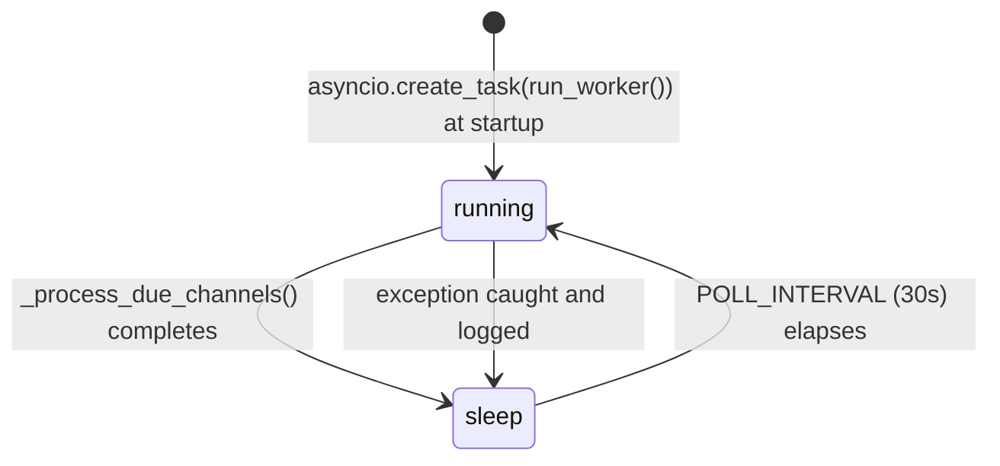

# Publishing Domain Rules

> **Context:** Read this file before modifying the background worker, adding a new platform publisher, or changing how PostChannel status transitions work.
> **Version:** 1.1

---

## 1. Core Principle

Publishing is fully asynchronous. The worker owns all status transitions from `pending`. Publishers never access the database. Errors per channel are isolated — one failing channel must never prevent other channels from being published.

---

## 2. What Is This Domain?

The publishing domain covers the background worker (`app/worker.py`) and the per-platform publisher modules (`app/publisher/`). The worker polls every 30 seconds and dispatches channels to publishers. Publishers are thin I/O modules that call external APIs.

### Key Concepts

| Concept | Description |
|---------|-------------|
| Worker | Async background task started at app startup via `asyncio.create_task()` |
| PostChannel | The unit of work for the worker; one per source per post |
| Publisher | Platform-specific module that calls the external API |
| `build_text()` | Utility that assembles final text from channel + post data |
| POLL_INTERVAL | 30 seconds between worker iterations |

---

## 3. Business Rules

**BR-001** — The worker polls every 30 seconds (`POLL_INTERVAL = 30`). Do not reduce below 10 seconds.
_Enforced in:_ `app/worker.py @ POLL_INTERVAL`

**BR-002** — The worker processes only `PostChannel` records where `status = pending` AND (`scheduled_at IS NULL` OR `scheduled_at <= now()`).
_Enforced in:_ `app/worker.py @ _process_due_channels()`

**BR-003** — The worker skips channels whose parent post has `status = draft`. Only `ready` and `published` post statuses are allowed.
_Enforced in:_ `app/worker.py @ _publish_channel()`

**BR-004** — One failed channel must not affect other channels. Each channel is published independently; errors are stored per-channel.
_Enforced in:_ `app/worker.py @ _publish_channel()` (individual channel loop)

**BR-005** — On success, set `channel.status = published` and `channel.published_at = datetime.now()`.
_Enforced in:_ `app/worker.py @ _publish_channel()`

**BR-006** — On failure, set `channel.status = failed` and `channel.error_message = error` (truncated to 500 chars). Do NOT set `channel.published_at`.
_Enforced in:_ `app/worker.py @ _publish_channel()`

**BR-007** — After each channel update, check if ALL channels of the post have `status = published`. If yes, set `post.status = published`.
_Enforced in:_ `app/worker.py @ _publish_channel()` (post-flush check)

**BR-008** — Every publisher module must implement `async def publish(text, source, image_paths) -> tuple[bool, str | None]`. Return `(True, None)` on success, `(False, "error")` on failure. Never raise from `publish()`.
_Enforced in:_ `app/publisher/telegram.py`, `app/publisher/vk.py`, `app/publisher/max_messenger.py`

**BR-009** — All ORM data needed by the publisher must be loaded before the first `await`. Publishers receive plain values, not ORM objects tied to a session.
_Enforced in:_ `app/worker.py @ _publish_channel()` (builds `image_paths`, `text_html`, `text_plain` before calling publishers)

**BR-010** — `build_text()` from `app.publisher.utils` must be used for all text assembly. Never build the text inline in the worker or publisher.
_Enforced in:_ `app/worker.py @ _publish_channel()`

**BR-011** — Images are capped at 10 per publish call across all platforms.
_Enforced in:_ `app/publisher/telegram.py`, `app/publisher/vk.py`, `app/publisher/max_messenger.py`

**BR-012** — Telegram uses `parse_mode=HTML`. Use `<b>title</b>` for bold. VK and MAX use plain text (no HTML tags).
_Enforced in:_ `app/publisher/utils.py @ build_text()` (`bold_title` parameter)

**BR-013** — `build_text()` converts `description` from raw markdown before appending it to the result. `bold_title=True` (Telegram) → markdown→HTML via `mistune`; `bold_title=False` (VK/MAX) → markdown→plain text (all HTML tags stripped). The title is never markdown-converted.
_Enforced in:_ `app/publisher/utils.py @ build_text()` / `_md_to_html()` / `_md_to_plain()`

---

## 4. Worker Lifecycle



The worker is started once in `lifespan()` in `main.py`. Never start multiple worker tasks. The worker must not crash the application — all exceptions in `run_worker()` are caught and logged via `log.exception()`.

---

## 5. Publisher Contract

```python
# ✅ Correct — catches all exceptions, returns tuple
async def publish(
    text: str,
    source,               # ORM source object — simple attributes only, no lazy load
    image_paths: list[str],  # absolute paths to image files on disk
) -> tuple[bool, str | None]:
    try:
        ...
        return True, None
    except Exception as e:
        return False, str(e)[:500]

# ❌ Incorrect — exception propagates, breaks channel status update
async def publish(text, source, image_paths):
    await _send(text)   # raises on failure
```

---

## 6. Platform-Specific Rules

### 6.1 Telegram

- **API base:** `https://api.telegram.org/bot{token}/{method}`
- **Text format:** HTML (`parse_mode=HTML`). Title wrapped in `<b>...</b>`.
- **Dispatch logic:**
  - 0 images → `sendMessage`
  - 1 image → `sendPhoto` with caption
  - 2–10 images → `sendMediaGroup` (caption on first item only, `parse_mode=HTML`)
- **thread_id:** set `message_thread_id` in all requests when `source.thread_id` is not None
- **Max images per call:** 10

### 6.2 VKontakte

- **API base:** `https://api.vk.com/method/{method}` with `v=5.199`
- **Text format:** plain text (no HTML)
- **owner_id for group posts:** `-abs(source.group_id)` (negative)
- **Photo upload flow:** `photos.getWallUploadServer` → upload binary → `photos.saveWallPhoto` → attach as `photo{owner_id}_{id}`
- **Group token photo limitation:** Community tokens fail with VK error 27. Log a WARNING and fall back to text-only — do NOT fail the channel.
- **wall.post:** set `from_group=1`

### 6.3 MAX Messenger

- **API base:** `https://botapi.max.ru`
- **Auth:** `access_token` query param (not header) for `POST /messages`
- **Text format:** plain text
- **Photo upload flow:** `POST /uploads?type=image` → get `url` → POST file → extract `token` → attach as `{"type": "image", "payload": {"token": "..."}}`
- **Message body:** `{"recipient": {"chat_id": id}, "type": "text", "text": "...", "attachments": [...]}`

---

## 7. Text Assembly

```python
from app.publisher.utils import build_text

# bold_title=True for Telegram (HTML), False for VK/MAX (plain)
text_html  = build_text(channel, post, bold_title=True)
text_plain = build_text(channel, post, bold_title=False)
```

`build_text()` output:
1. `<b>effective_title</b>` or `effective_title` (plain) — title is never markdown-converted
2. `effective_description` converted from raw markdown: HTML for Telegram, plain text for VK/MAX (if present)
3. `#hashtag_one #hashtag_two` (if `post.tags` present)

Parts joined with `\n\n`.

---

## 8. Adding a New Platform Publisher

Follow this checklist:

1. Create `app/models/sources/{platform}.py` — ORM model with `EncryptedString` for tokens
2. Create `app/publisher/{platform}.py` — implement the `publish()` contract
3. Create `app/views/{platform}_source.py` — `CustomView` + `EditorAccessMixin` wizard
4. Register the source in `app/admin.py` (DropDown + wizard view)
5. Extend `app/worker.py @ _publish_channel()` — add dispatch branch for the new `source_type`
6. Add new `source_type` string to `_resolve_source()` in `app/views/posts.py`
7. Add the new source to wizard step 2 source picker and step 2 POST handler in `PostWizardView`
8. Register `ai_prompt_title` and `ai_prompt_description` in `_migrate()` if needed
9. Add connection test endpoint to `app/routers/source.py`
10. Update `rules/database/schema.md`, `rules/domain/sources.md`, and this file

---

## Forbidden Behaviors

- ❌ Raising exceptions from `publish()` — always return `(False, "error")`
- ❌ Accessing ORM relations via lazy load inside `publish()` — load data before `await`
- ❌ Setting `channel.status` or `post.status` anywhere except the worker
- ❌ Starting more than one worker task
- ❌ Assembling post text inline — always use `build_text()`
- ❌ Sending more than 10 images in a single call
- ❌ Using HTML in VK or MAX text — plain text only

---

## Checklist

- [ ] New publisher implements `publish(text, source, image_paths) -> tuple[bool, str | None]`
- [ ] All exceptions caught inside `publish()`, never raised
- [ ] ORM lazy-loading not performed inside `publish()` — all data loaded before `await`
- [ ] `build_text()` used for text assembly; `bold_title=True` for Telegram only
- [ ] Worker updated with new `source_type` dispatch branch
- [ ] Channel and post status updated by worker only
- [ ] `post.status = published` only after ALL channels are published
- [ ] Image count capped at 10
- [ ] VK group-token photo failure handled as WARNING + text-only fallback
